**SCOPO DI INTERPRETER**

Dato un linguaggio, definisce una rappresentazione per la sua grammatica e un interprete che usi la grammatica per interpretare le proposizioni del linguaggio.

**STRUTTURA**

