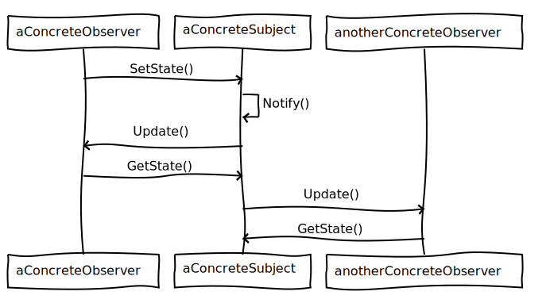

**SCOPO DI OBSERVER**

Definire una dipendenza uno a molti fra oggetti, in modo tale che se un oggetto cambia il suo stato, tutti gli oggetti dipendenti da questo siano ***notificati*** 
e aggiornati automaticamente.

**PARTECIPANTI**

**Subject:** conosce i propri observer. Fornisce un'interfaccia per registrare o deregistrare oggetti Observer.Il Subject è detto anche ***Observable***.

**Observer:** fornisce un interfaccia di notifica per gli oggetti a cui devono essere associati i cambiamenti nel Subject.

**ConcreteSubject:** contiene lo stato e inoltra una notifica ai suoi Observer quando questo si modifica.

**ConcreteObserver:** memorizza un riferimento ad un oggetto ConcreteSubject. Contiene informazioni che devono essere ***costantemente sincronizzate*** con lo stato del Subject.
Implementa l'interfaccia di notifica di Observer per mantenere il proprio stato consistente con quello del Subject.

**COLLABORAZIONI:** 

**OBSERVER IN JAVA**

In Java sono disponibili:

**java.beans.PropertyChangeListener: ** che è l'***Observer***

Gli ***Observable (Subject)*** devono memorizzare un riferimento a ***PropertyChangeSupport*** per effettuare la registrazione 
e la deregistrazione degli ***Observer***.

**CONSIDERAZIONE PERSONALE:**
Observer è tra i miei pattern comportamentali preferiti.