**SCOPO DI ABSTRACT FACTORY**

Fornire un'interfaccia per la creazione di famiglie di oggetti correlati o dipendenti senza specificare quali siano le loro classi concrete.

**STUTTURA**

Come si può notare dallo schema soprastante il cliente conosce solo le classi ***astratte***.