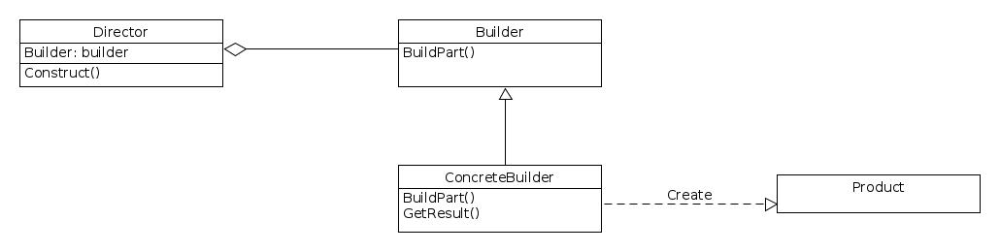
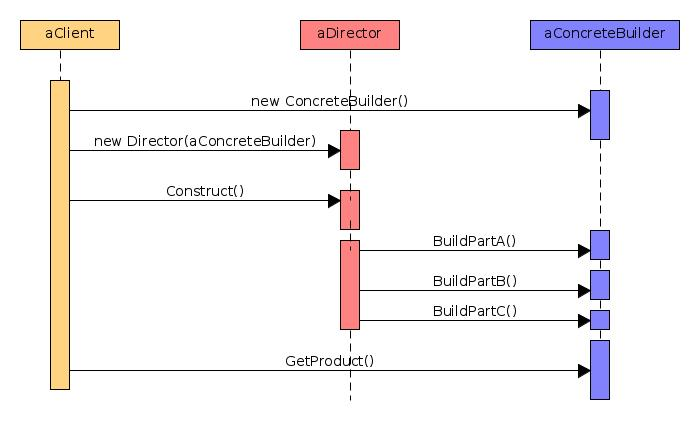

**SCOPO**
Separare la costruzione di un ***oggetto complesso*** dalla sua rappresentazione, in modo che lo stesso processo di costruzione possa essere utilizzato per creare rappresentazioni diverse.

**PROBLEMA**
Rendere flessibili eventuali modifiche della struttura di oggetti che formano un ***oggetto complesso*** e del processo di creazione di tali strutture.

**SOLUZIONE**
Invece di distribuire la ***responsabilità*** della creazione tra i vari oggetti è più conveniente localizzare in un unico punto la logica di creazione dell'intera struttura

**STRUTTURA**

**COLLABORAZIONI**

